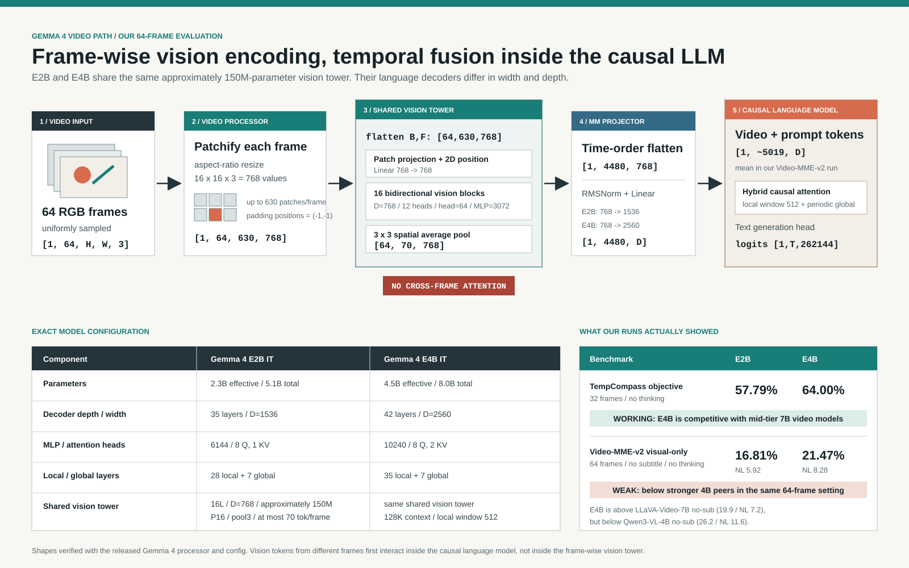

# Gemma 4 Video Benchmark Results

## Architecture note

For the 64-frame Video-MME-v2 protocol, the released processor produces
`pixel_values_videos` with shape `[1, 64, 630, 768]`. The final dimension is a
flattened `16 x 16 x 3` RGB patch. Gemma 4 flattens batch and frame dimensions,
so its 16-layer, width-768 vision tower processes `[64, 630, 768]` without
cross-frame attention. A `3 x 3` spatial pool yields at most 70 visual tokens
per frame. These are concatenated in time order into `[1, 4480, 768]`, then an
RMS-normalized linear projector maps them to width 1536 for E2B or 2560 for
E4B before insertion into the causal language model.

This means temporal interaction occurs primarily in the language decoder. The
released vision tower itself is a shared frame encoder, not a temporal video
encoder.

## TempCompass objective subset

Protocol: 32 uniformly sampled frames with original timestamps, native Gemma 4
video input, thinking disabled, greedy answer-only decoding. The evaluated set
contains all 5,536 objective questions from multi-choice, yes/no, and caption
matching. Caption generation is excluded because its official evaluation needs
an external semantic judge.

| Model | Overall | Multi-choice | Yes/no | Caption matching | Peak GPU memory |
|---|---:|---:|---:|---:|---:|
| Gemma 4 E2B IT | 57.79% | 49.81% | 58.21% | 65.47% | 10.11 GiB |
| Gemma 4 E4B IT | 64.00% | 57.97% | 63.19% | 71.66% | 15.41 GiB |

Both runs completed all 5,536 questions with zero inference errors. E4B improves
the overall score by 6.21 percentage points under the identical protocol.

This is not an across-the-board failure. On the three directly scored task
formats, E4B is around the middle of the public 7B-class results rather than at
the bottom. The public TempCompass leaderboard uses model-specific prompting
and frame protocols, so the following is contextual rather than a controlled
head-to-head comparison.

| Public reference | Multi-choice | Yes/no | Caption matching |
|---|---:|---:|---:|
| Gemma 4 E2B, our run | 49.81% | 58.21% | 65.47% |
| Gemma 4 E4B, our run | 57.97% | 63.19% | 71.66% |
| Video-LLaVA-7B, public board | 45.57% | 56.38% | 63.34% |
| LongVA-7B, public board | 56.14% | 62.13% | 65.67% |
| InternVL2-8B, public board | 65.57% | 68.24% | 77.11% |

### Temporal dimensions

The following aggregates each temporal dimension across all three objective
task formats, weighted by the number of questions.

| Dimension | E2B | E4B | E4B gain |
|---|---:|---:|---:|
| Action | 81.50% | 87.94% | +6.44 pp |
| Attribute change | 54.20% | 61.23% | +7.03 pp |
| Direction | 44.72% | 50.26% | +5.54 pp |
| Order | 56.10% | 65.04% | +8.94 pp |
| Speed | 50.22% | 53.80% | +3.58 pp |

## Video-MME-v2

Protocol: all 3,200 questions over 800 videos, 64 uniformly sampled frames with
original timestamps, native Gemma 4 video input, visual-only, thinking disabled,
greedy decoding, and at most 128 generated tokens. The nonlinear score follows
the benchmark's official four-question relevance and logic group rules.

| Model | Accuracy | Nonlinear score | Strict letter | Limit hits | Peak memory | Mean latency |
|---|---:|---:|---:|---:|---:|---:|
| Gemma 4 E2B IT | 16.81% | 5.92 | 72.84% | 339 | 10.72 GiB | 12.38 s |
| Gemma 4 E4B IT | 21.47% | 8.28 | 92.56% | 173 | 16.04 GiB | 9.59 s |

Both models completed 3,200 questions and 800 complete groups with zero
inference errors. E4B gains 4.66 accuracy points and 2.37 nonlinear-score
points. Its grouped score improves proportionally more than its question-level
accuracy, indicating more consistent answers across related questions.

Here the result is genuinely weak. Against public visual-only, no-subtitle
entries with approximately the same frame count, E4B is above LLaVA-Video-7B
but below stronger 4B-class models. E2B is below even that LLaVA reference.

| Visual-only reference | Frames | Accuracy | Nonlinear score |
|---|---:|---:|---:|
| Gemma 4 E2B, our run | 64 | 16.81% | 5.92 |
| Gemma 4 E4B, our run | 64 | 21.47% | 8.28 |
| LLaVA-Video-7B, public board | 64 | 19.9% | 7.2 |
| Qwen3.5-4B-Instruct, public board | 64 | 24.1% | 9.5 |
| Qwen3-VL-4B-Instruct, public board | 64 | 26.2% | 11.6 |
| Gemma 4 31B, public board | 60 | 36.7% | 19.0 |

The run measures the released models in a deterministic no-thinking,
visual-only setting; it is not their maximum-capability setting. E2B also has a
72.84% strict answer-format rate and 339 generation-limit hits, so its absolute
score is less clean. E4B follows the requested answer format 92.56% of the time
and remains low, making its Video-MME-v2 weakness much harder to explain away
as parsing alone.

### Evaluation levels

| Level | E2B accuracy | E4B accuracy | E2B group | E4B group |
|---|---:|---:|---:|---:|
| Level 1: retrieval and aggregation | 20.80% | 26.59% | 9.11 | 10.38 |
| Level 2: temporal understanding | 15.92% | 19.73% | 5.76 | 9.00 |
| Level 3: temporal complex reasoning | 13.84% | 18.21% | 4.17 | 6.56 |

### Capability differences

| Capability | E2B | E4B | E4B gain |
|---|---:|---:|---:|
| Order | 16.62% | 24.78% | +8.16 pp |
| Frame-Only | 22.09% | 29.22% | +7.13 pp |
| Video-Based Knowledge Acquisition | 13.83% | 20.57% | +6.74 pp |
| Social Behavior Analysis | 13.38% | 17.84% | +4.46 pp |
| Frames & Audio | 19.25% | 23.43% | +4.18 pp |
| Action & Motion | 13.48% | 17.38% | +3.90 pp |
| Physical World Reasoning | 11.74% | 15.44% | +3.69 pp |
| Complex Plot Comprehension | 16.87% | 19.28% | +2.41 pp |
| Change | 17.36% | 18.18% | +0.83 pp |
| Temporal Reasoning | 16.48% | 15.93% | -0.55 pp |

`Strict letter` is the fraction of responses that obeyed the requested single
A-H format. `Limit hits` counts responses that reached the 128-token cap. The
reported score uses the benchmark's official regex extraction, so the limit-hit
count should be retained when interpreting or comparing these runs. This is the
standard visual-only setting; it must not be compared directly with runs that
include subtitles or audio.

## Reproducibility note

The environment uses `torch==2.13.0`, `transformers==5.15.0`, and
`decord==0.6.0`. Transformers 5.15 returns Gemma 4 split video features as a
tuple while the forward path expects a tensor. The evaluator conditionally
concatenates this tuple and leaves tensor outputs unchanged.

Architecture values come from the released
[E2B config](https://huggingface.co/google/gemma-4-E2B-it/blob/main/config.json),
[E4B config](https://huggingface.co/google/gemma-4-E4B-it/blob/main/config.json),
and [processor config](https://huggingface.co/google/gemma-4-E4B-it/blob/main/processor_config.json).
Comparison values come from the public
[TempCompass leaderboard](https://huggingface.co/spaces/lyx97/TempCompass) and
[Video-MME-v2 leaderboard](https://video-mme-v2.netlify.app/#leaderboard).
